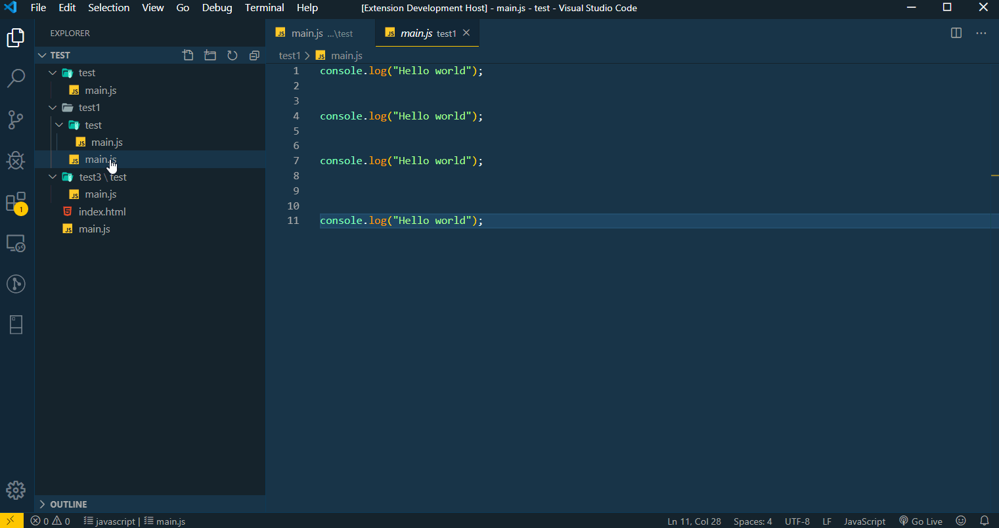

# **JSObfuscator**

[](https://marketplace.visualstudio.com/items?itemName=softheroes.jsobfuscator)&ensp;[](https://marketplace.visualstudio.com/items?itemName=softheroes.jsobfuscator)&ensp;[](https://marketplace.visualstudio.com/items?itemName=softheroes.jsobfuscator)


## **Features**
This extension will obfuscate and minify your JavaScript code to make it more secure.

### **Note** 

Once the code gets obfuscated you cannot revert it to it's original state. For best use, use this before deployment of your code.

#

## **Commands**
### **JSObfuscator : Obfuscate Current Workspace**
This command will go through and obfuscate all the js files in your current Workspace. See settings for options to limit which files will be obfuscated.
### **JSObfuscator : Obfuscate Current File**
This command will obfuscate the file you currently have open. This requires you to have saved this file before obfuscating it. This command will also ignore the settings `Ignore Min Files` and `Files To Ignore`

### **Note**
By default code pages will be saved as a new file with their extension changed to .min.js and by default existing files will not be overwriten.

### **Usage**
Press `Ctrl`+`Shift`+`P` and search for `JSObfuscator: Obfuscate Current Workspace` to obfuscate your current Workspace recursively or search for `JSObfuscator: Obfuscate Current File` to obfuscate the current file. You have to have saved the current file before you can obfuscate it.



#

## **Settings**

### **Change File Extension**
**Default**: `obfuscated.js` \
**Description**: Save the file with a new extension after obfuscating. For example if you put obfuscated.js the file would be changed from test.js to test.obfuscated.js. But, if you try to obfuscating test.obfuscated.js this file will be skipped.
### **Files To Ignore**
**Default**: \
**Description**: Enter comma separated list of file names to be ignored
### **Ignore Min Files**
**Default**: `true` \
**Description**: When processing the Workspace to obfuscate all js files do you want to ignore files with the extension .min.js
NOTE: This option is ignored when processing a single file.
### **Overwrite Existing Files**
**Default**: `false` \
**Description**: When saving the obfuscated file if a file of the same name exists overwrite it with the obfuscated file.
### **Relative Path To Process**
**Default**: \
**Description**: Limit obfuscation by specifying a relative path / sub directory within your Workspace to process.
### **JavaScript-obfuscator**
**Default**: 
```
{
    "compact": true,
    "controlFlowFlattening": true,
    "deadCodeInjection": false,
    "debugProtection": false,
    "debugProtectionInterval": false,
    "disableConsoleOutput": true,
    "identifierNamesGenerator": "hexadecimal",
    "log": false,
    "renameGlobals": false,
    "rotateStringArray": true,
    "selfDefending": true,
    "shuffleStringArray": true,
    "splitStrings": false,
    "stringArray": true,
    "stringArrayEncoding": false,
    "stringArrayThreshold": 0.75,
    "unicodeEscapeSequence": false
}
```
**Description**: Enter options to be passed into javascript-obfuscator see the [javascript-obfuscator documentation](https://www.npmjs.com/package/javascript-obfuscator#preset-options) \
**Note**: This needs to be done by editing your settings.json file. Here is an example of a settings.json file for just the JSObfuscator plugin.
```
{
    "JSObfuscator" : {
        "changeExtension": "min.js",
        "filesToIgnore": "",
        "ignoreMinFiles": true,
        "javascript-obfuscator": {
            "compact": true,
            "controlFlowFlattening": true,
            "deadCodeInjection": false,
            "debugProtection": false,
            "debugProtectionInterval": false,
            "disableConsoleOutput": true,
            "identifierNamesGenerator": "hexadecimal",
            "log": false,
            "renameGlobals": false,
            "rotateStringArray": true,
            "selfDefending": true,
            "shuffleStringArray": true,
            "splitStrings": false,
            "stringArray": true,
            "stringArrayEncoding": false,
            "stringArrayThreshold": 0.75,
            "unicodeEscapeSequence": false
        },
        "overwriteExistingFiles" : false,
        "relativePathToProcess": ""
    } 
}
```

#

## **⚠ Important**
### **Only obfuscate code that belongs to you**

It is not recommended to obfuscate vendor scripts and polyfills, since the obfuscated code is 15-80% slower (depending on options) and the files are significantly larger.

#

## **Dependencies**
This extension use [JavaScript obfuscator](https://github.com/javascript-obfuscator/javascript-obfuscator)

#

## **TODO**

* Update gif in Usage

#

## **Github & Issues**

Feel free to modify/change or create a new better version using this [Repo](https://github.com/SoftHeroes/JSObfuscator). If you find any issues you can report [Here](https://github.com/SoftHeroes/JSObfuscator/issues).

__*`Write a review if this plugin helps you out anyhow`*__

**Enjoy! 🤗**
